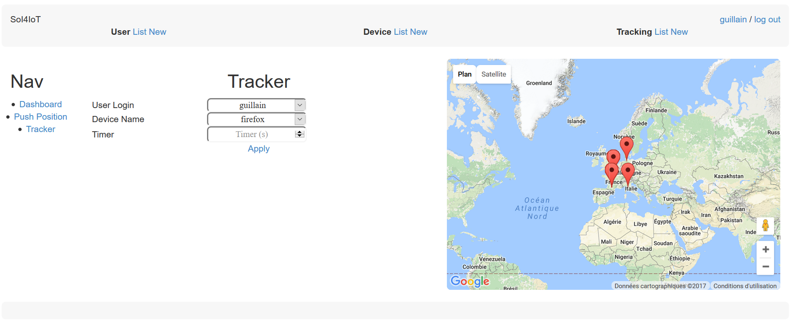
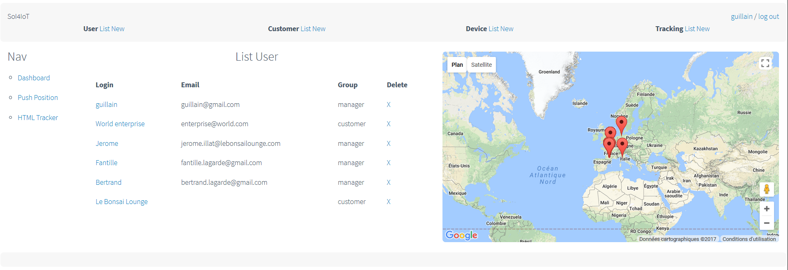
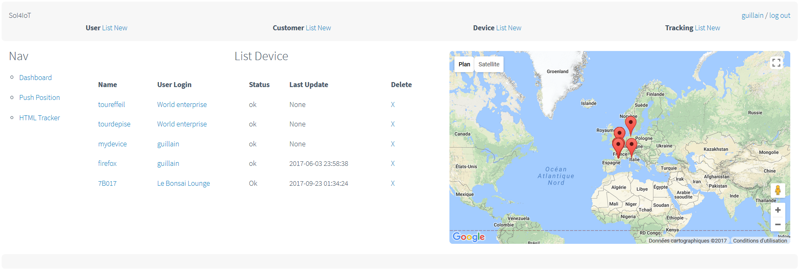
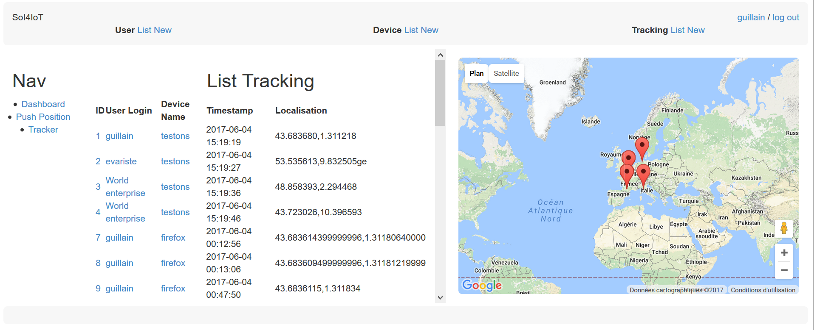
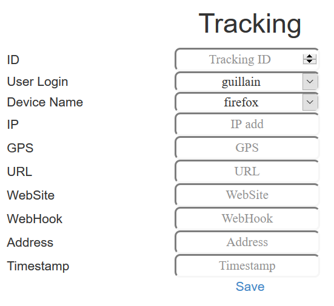

# SoI4IoT
System of Information For Internet of Things
Provide web management interface to track and manage IoT activities

## Featues
* Google Map
* Dashboard
* Push personnal web position by web click as GPS tracker
* Auto polling of the web position (can be forked for IoT device ;)
* * 
* Each user, device and tracking are browsable

## Doc
* [Install](doc/install.md)
* [ToDo](doc/todo.md)

## Management
* User
* * 
* * 
* Sevice (IoT, web browser...)
* * 
* * 
* Tracking (linked to user and device)
* * 
* * {: height="36px"}

## Credits
* Flask
* MySQL
* Google Map API

Have fun ;)
