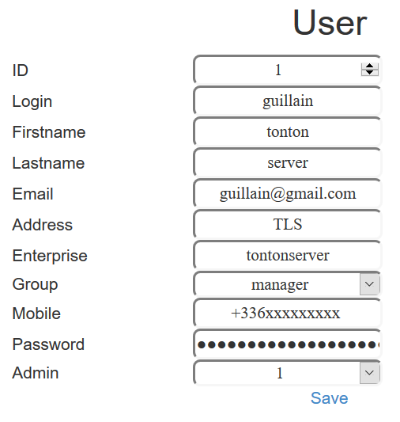

# SoI4IoT
System of Information For Internet of Things
Provide web management interface to track and manage IoT activities

## Featues
* Google Map
* Dashboard
* Push personnal web position by web click as GPS tracker
* Auto polling of the web position (can be forked for IoT device ;)

* Each user, device and tracking are browsable

## Doc
* [Install](doc/install.md)
* [ToDo](doc/todo.md)
* [Bug](doc/bug.md)

## Management
### User
* 
* 
### Sevice (IoT, web browser...)
* 
* 
### Tracking (linked to user and device)
* 
* 

## Credits
* Flask
* MySQL
* Google Map API

Have fun ;)
