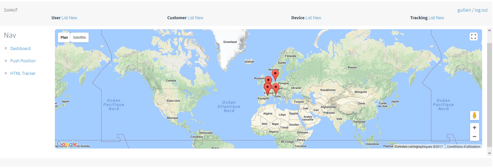
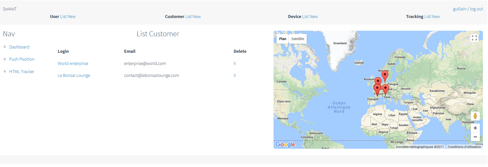
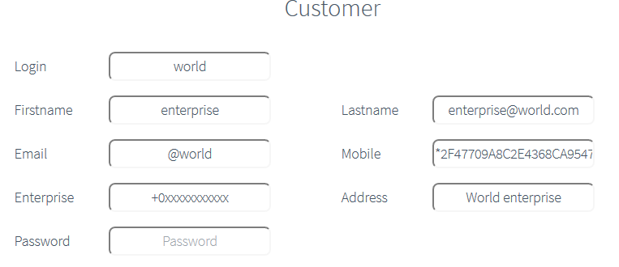

# SoI4IoT
System of Information For Internet of Things
Provide web management interface to track and manage IoT activities

## Featues
* Full REST API synch with the SQL structure
* Google Map
* Dashboard
* Push personnal web position by web click as GPS tracker
* Auto polling of the web position (can be forked for IoT device ;)
* Each user, device and tracking are browsable
* API server secured by simple auth (at this time, code ongoing for token)

## Validation done
Already integrated and validated with the following IoT components:
* Bt.tn button with sigfox communication
* Arduino with Wifi ESP8266 & Sigfox
* Security (api auth + crypting)

## Doc
* [Install](doc/install.md)
* [ToDo](doc/todo.md)
* [Bug](doc/bug.md)

## Feature
### Dashboard
* 

### Tracker
* 

## Management
### User
* 
* 

### Customer
* 
* 

### Device (IoT, web browser...)
* 
* 

### Tracking (linked to user and device)
* 
* 

## Credits
* Flask
* MySQL
* Google Map API

Have fun ;)
